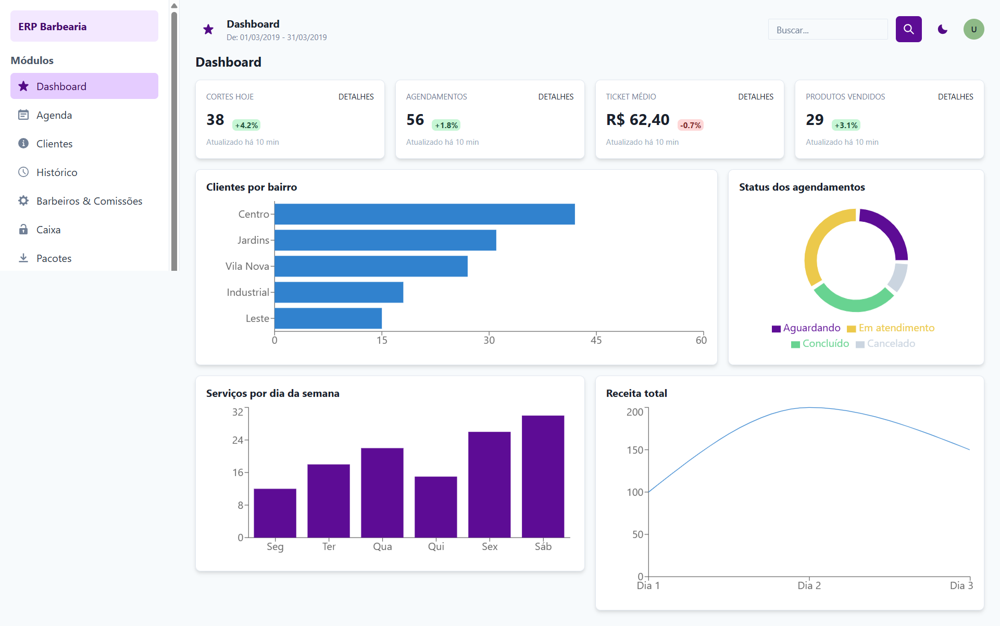
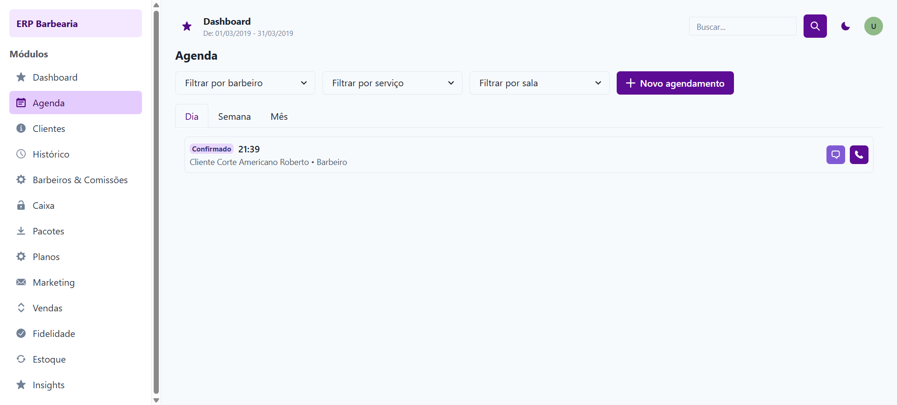
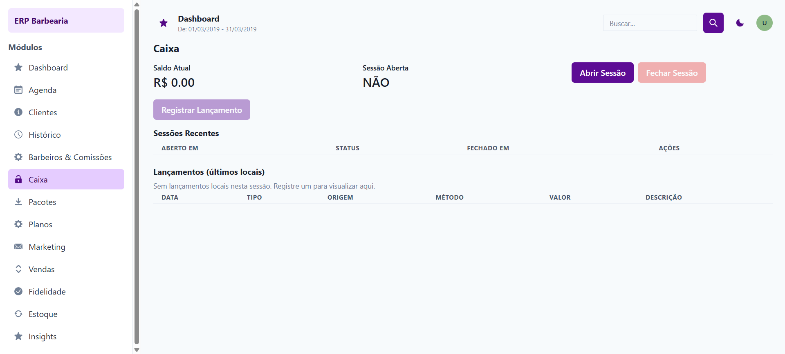
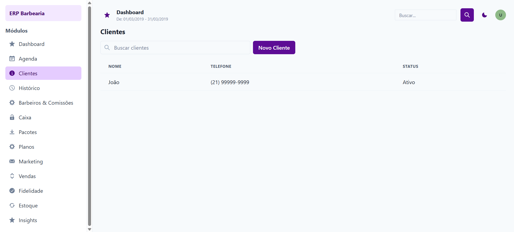
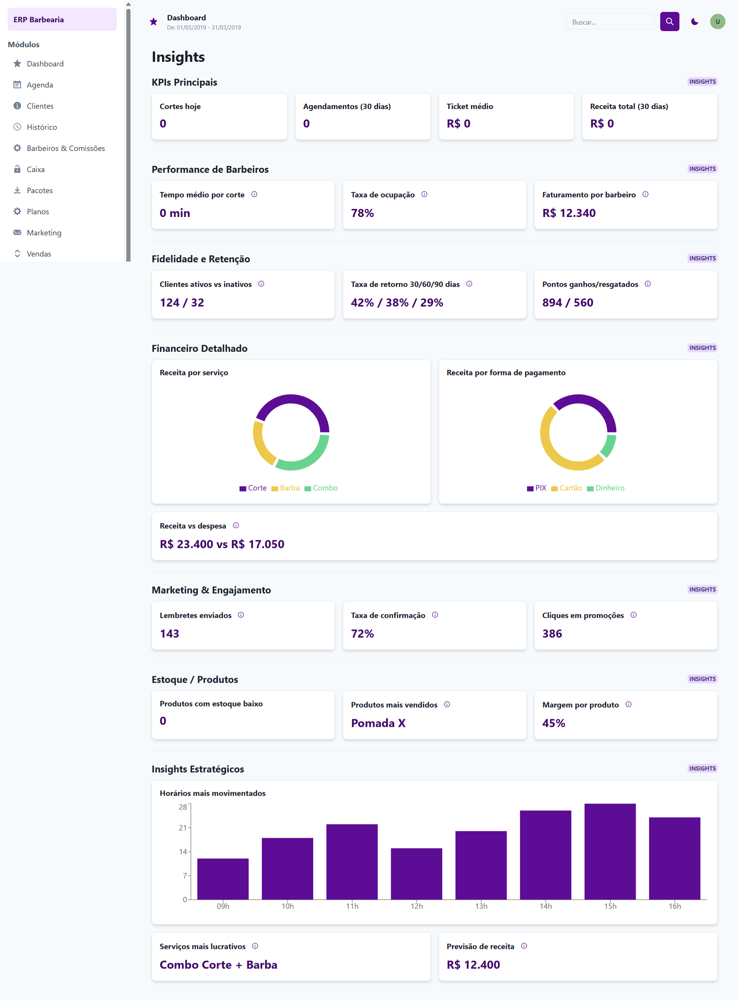

# 💈 ERP Aesthetic Barber SaaS

🧠 SISTEMA ENTERPRISE SAAS DE GESTÃO PARA BARBEARIAS  
Solução completa com arquitetura moderna, escalável e orientada a eventos.

==================================================

🔗 LIVE DEMO  
https://erp-aesthetic-empresarial-git-demo-mailogdestas-projects.vercel.app?_vercel_share=WEQV7Ve9qlfHY3SPdJLk4LRbWfCg5HBF

📦 REPOSITÓRIO  
https://github.com/Mailogdestas/erpempresarial

==================================================

⚡ DEMONSTRAÇÃO

🔓 Versão demo disponível (sem necessidade de login)

ACESSO:  
Email: demo@demo.com  
Senha: demo123  

==================================================

🎬 VISÃO GERAL VISUAL

## 📊 Dashboard principal

Visão geral financeira, agendamentos e indicadores em tempo real.

---

## 📅 Agenda

Gestão de horários, agendamentos e controle de atendimento dos barbeiros.

---

## 💰 Caixa

Controle financeiro completo com entradas, saídas e fluxo diário.

---

## 👥 Clientes

CRM para gerenciamento de clientes e histórico de atendimentos.

---

## 📊 Relatórios

Dashboards analíticos com KPIs e relatórios de performance.

==================================================

🎯 VISÃO GERAL

ERP completo para gestão de barbearias com foco em:

- Multi-tenant SaaS
- Alta performance
- Automação de processos
- Controle financeiro completo
- Dashboard moderno e responsivo

==================================================

🚀 FUNCIONALIDADES

💈 GESTÃO OPERACIONAL
- Agendamentos inteligentes
- CRM de clientes
- Histórico de atendimentos
- Gestão de barbeiros e serviços

💰 FINANCEIRO
- Controle de caixa em tempo real
- PDV (ponto de venda)
- Controle de despesas e receitas
- Relatórios financeiros automáticos

📦 ESTOQUE
- Controle de inventário
- Baixa automática por vendas
- Alertas de estoque baixo

📊 ANALYTICS E RELATÓRIOS
- Dashboards em tempo real
- KPIs de performance
- Relatórios automáticos e inteligentes

==================================================

🧠 ARQUITETURA TÉCNICA

Frontend:
- React
- TypeScript
- Vite
- TailwindCSS
- Zustand
- Recharts

Backend:
- NestJS
- Prisma ORM
- PostgreSQL
- JWT Authentication
- Arquitetura orientada a eventos

==================================================

🏗️ FLUXO DO SISTEMA

Frontend (React)
        ↓
Backend API (NestJS)
        ↓
Banco de Dados (PostgreSQL + Redis)
        ↓
Event-Driven Architecture

==================================================

🔐 AUTENTICAÇÃO E SEGURANÇA

- JWT Authentication
- RBAC (Admin / Manager / Barber)
- Proteção de rotas
- Sessões seguras

==================================================

🧪 COMO RODAR LOCALMENTE

git clone https://github.com/Mailogdestas/erpempresarial.git
cd frontend

npm install
npm run dev

==================================================

🌐 STACK COMPLETA

Frontend:
- React
- TypeScript
- TailwindCSS
- Zustand
- Recharts

Backend:
- NestJS
- Prisma
- PostgreSQL
- JWT

==================================================

📂 ESTRUTURA DO PROJETO

frontend/
 ├── pages/
 ├── components/
 ├── lib/
 └── auth/

backend/
 ├── domains/
 ├── core/
 └── prisma/

==================================================

🧪 DESTAQUES TÉCNICOS

- Arquitetura orientada a eventos (Event-Driven)
- Separação por domínios (DDD básico)
- Sistema SaaS multi-tenant
- Automação completa de fluxo de vendas
- Controle financeiro avançado
- Escalabilidade real para produção

==================================================

💈 ERP AESTHETIC SAAS  
Sistema profissional de gestão para barbearias
